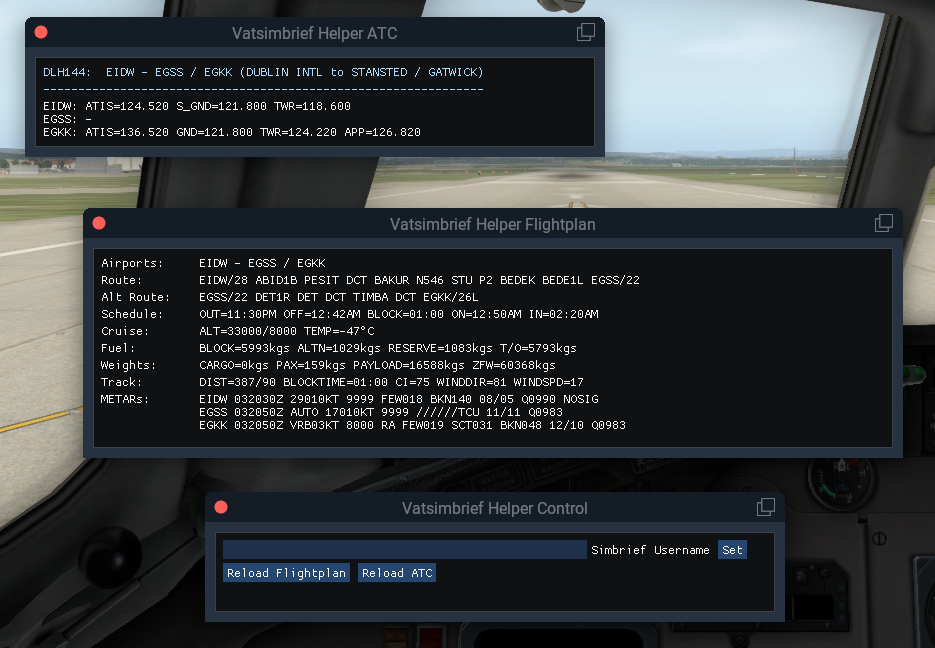

# Vatsimbrief Helper

## Overview

The plugin provides information from the **Simbrief flightplan** and relevant **VATSIM frequencies** for ATC communications in X-Plane 2D and VR flight setups.

It solves major issues that VR pilots usually face:

* A printed flightplan can not be taken into VR. And even if the resolution of the VR device allows for, scrolling through tiny Simbrief flightplan fonts is usually very exhausting.
* VATSIM frequencies can not be obtained from official charts (e.g. Navigraph). Also, taking notes in VR takes a lot of time, which easily distresses pilots.
* Air traffic control stations are highly volatile. When using the plugin it can be avoided to approach an unmonitored airport. Instead, pilots can divert to their alternate where there are air traffic controllers on service.

## Installation

* Install FlyWithLua plugin: https://forums.x-plane.org/index.php?/files/file/38445-flywithlua-ng-next-generation-edition-for-x-plane-11-win-lin-mac/
* Download the [latest release of this plugin](https://github.com/RedXi/vatsimbrief-helper/releases/latest)
* Extract the zip-File folders into `<X-Plane-Directory>/Resources/plugins/FlyWithLua` and, if asked, overwrite existing files
* During first launch, a configuration window will show automatically. Enter your *VATSIM-Username* and press *Set*.

## Usage

* Windows can be toggled inside the plugins menu: `Plugins / FlyWithLua / FlyWithLua Macros` and select one of the following windows:
  * `Vatsimbrief Helper Flightplan`: Opens/closes a window showing a relevant excerpt of the flightplan.
  * `Vatsimbrief Helper ATC`: Opens/closes a window showing relevant ATC frequencies.
  * `Vatsimbrief Helper Control`: Opens/closes a window for setting the Simbrief username or reloading the flightplan or ATC data manually.
* If an attribute has two values separated by '/', the left value refers to the **destination** and the right one to the **alternate**
* Windows will refresh automatically every minute.

**Happy Flying!**

## Dependencies

Required runtime Lua dependencies: copas, luasocket, binaryheap.lua, coxpcall, timerwheel.lua, LIP, xml2lua

They are bundled with the release artifact.
