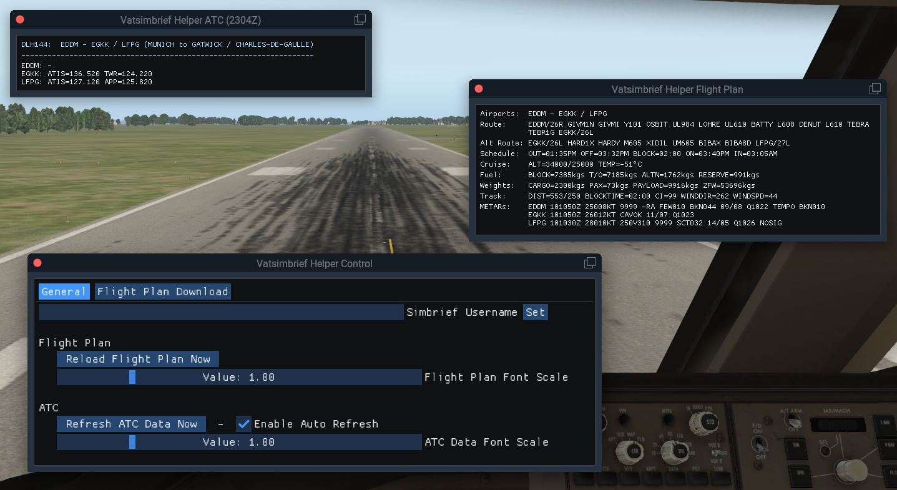

# Vatsimbrief Helper

## Overview

The plugin provides information from the **Simbrief flight plan** and/or relevant **VATSIM frequencies** for ATC communications in X-Plane 2D and VR flight setups.

It solves major issues that VR pilots usually face:

* A printed flight plan can not be taken into VR. And even if the resolution of the VR device allows for, scrolling through tiny Simbrief flight plan fonts is usually very exhausting. Instead, there is a window showing the most important information from the flight plan, just enough to operate and monitor the flight.
* VATSIM frequencies can not be obtained from official charts (e.g. Navigraph). Also, taking notes in VR takes a lot of time, which easily distresses pilots.
* Air traffic control stations are highly volatile. When using the plugin it can be avoided to approach an unmonitored airport. Instead, pilots can divert to their alternate where there are air traffic controllers on service.
* For Co-Op / Multi Crew VATSIM flights, depending on who's going to file the flight plan, it's annoying to share the corresponding VATSIM client file over and over again. Especially when performing last minute changes. Therefore, the download can now performed automatically along with displaying the flight plan in the cockpit.

## Installation

* Install FlyWithLua plugin: https://forums.x-plane.org/index.php?/files/file/38445-flywithlua-ng-next-generation-edition-for-x-plane-11-win-lin-mac/
* Download the [latest release of this plugin](https://github.com/RedXi/vatsimbrief-helper/releases/latest)
* Extract *all* folders in the zip-File to `<X-Plane-Directory>/Resources/plugins/FlyWithLua/` and, if asked, overwrite existing files. It's **not** sufficient to put the script `vatsimbrief-helper.lua` into the `scripts`-Directory!
* During first launch, a configuration window will show automatically. Enter your *Simbrief Username* and press *Set*.

## Usage

* Create your flight plan on [simbrief](https://www.simbrief.com/) as usual, at some time before takeoff.
* Windows can be toggled inside the plugins menu `Plugins / FlyWithLua / FlyWithLua Macros`:
  * `Vatsimbrief Helper Flight Plan`: Opens/closes a window showing a relevant excerpt of the flight plan.
  * `Vatsimbrief Helper ATC`: Opens/closes a window showing relevant ATC frequencies that will refresh every minute, if "Auto Refresh" is enabled.
  * `Vatsimbrief Helper Control`: Opens/closes a window for setting the Simbrief username, reloading the flight plan or ATC data manually, and configuring the download of flight plans. The settings window should be closed during the flight. It shows a big lumpy to simplify user interaction in VR.
* If an attribute has two values separated by `/`, the left value refers to the **destination** and the right one to the **alternate**
* If you find that the font in a window is too small, scale it up by dragging the bottom right corner of each window. If you permanently want to adjust the font size, there's a setting in the settings menu. The window will automatically adjust to the configured font size the next time it opens.
* Note that the visibility of windows will be saved between sessions. To restore a window, reopen it manually in the menu `Plugins / FlyWithLua / FlyWithLua Macros`.

**Happy Flying!**

## Dependencies

Required runtime Lua dependencies: copas, luasocket, binaryheap.lua, coxpcall, timerwheel.lua, LIP, xml2lua

They are bundled with the release artifact.

## FAQ

*Could the plugin provide more automatism and/or interactivity, e.g. calculate the remaining time to scheduled take off?*

The plugin is not going to become another FMC. It's meant to provide the pilot with necessary information to do his job.

*I'm not using VATSIM. Does it make sense to use this plugin?*

Sure. One can close the ATC window in the menu at `Plugins / FlyWithLua / FlyWithLua Macros` and only use the precious flight plan information. On the other hand, only using VATSIM without Simbrief does not make sense as the output of the ATC window is based on an active flight plan.

## Feedback

You're welcome to provide feedback or report issues on [gitlab](https://github.com/RedXi/vatsimbrief-helper).
